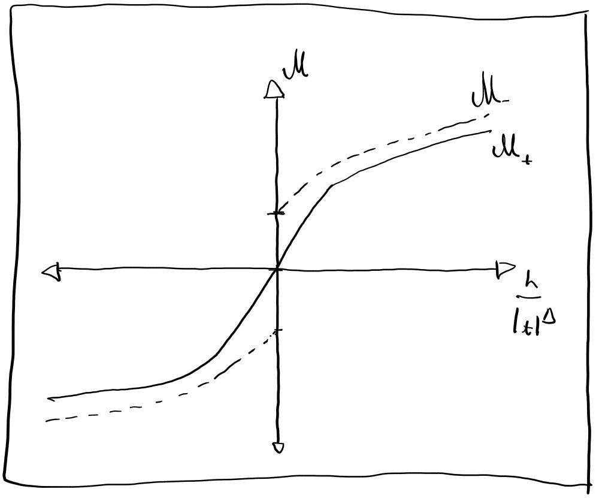
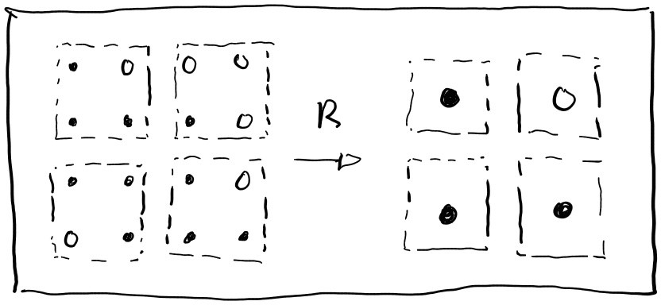

# Wk 3 Additional reading

## Foreword:
Some additional reading was done throughout Wk3 whilst waiting for data to generate.
This page summarises some of that reading.

## Temperature normalisation reading
Reading more through [@ComplexityAndCriticality] whilst waiting for data to generate.

Note to self, can incorporate boltzman distribution Eq. 0.4:

$p = \frac{e^{-H\beta}}{Z}$ \ \ \ \ \ \ \ \ \ \ \ \  Eq. 0.4

Into observable average as:

$<A> = \frac{1}{Z}\sum{e^{-H\beta} \cdot A_{i}}$  \ \ \ \ \ \ \ \ \ \ \ \  Eq. 3.1

my be useful to better compute observables in main config
Also, may be useful to normalise observables to number of spins (\frac{A}{N})

## Scaling laws reading 
[@ComplexityAndCriticality] has a section on scaling laws (p188 onwards); the key insight worth taking away is normalising the temperature.
The critical exponents for a given observable typically look like:

$O \propto |T-T_{c}|^{\beta}$ 

the insight is to normalise $T$ as:

$t=\frac{T-T{c}}{T_{c}}$ \ \ \ \ \ \ \ \ \ \ \ \  Eq. 3.6

s.t that the exponent expression become:

$O \propto |t|^{\beta}$  \ \ \ \ \ \ \ \ \ \ \ \  Eq. 3.7

$O = h(x) |t|^{\beta}$  \ \ \ \ \ \ \ \ \ \ \ \  Eq. 3.8

where $h(x)$ represents some scaling function. The book goes into further detail as to what these scaling functions should look like, however given the data being generated, it should be possible to fit for $h(x)$ and $\beta$ empirically. It may be interesting to compare the empirically fit $h(x)$ to analytical solutions if time allows, but it seems that its possible to entirely bypass that analytical component (which makes this project more straightofrward for the moment).

Note the book goes into some detail about the scaling function. Examining the scaling function for magnetisation specifically, it generally has the shape:

{fig-align="left"}

And relationships:

$lim_{x\to 0}M_{+}(x)=0$  \ \ \ \ \ \ \ \ \ \ \ \  Eq. 3.9

$lim_{x\to 0}M_{-}(x)=c \ne 0$  \ \ \ \ \ \ \ \ \ \ \ \  Eq. 3.10

So when fitting the data, it will be necessary to consider which side of the critical point is being evaluated

## Scaling laws and renomrlasation reading
The textbook [@scalingCardy] has a chapter going over group renormalisation methods.
I don't fully understand the concept, but will attempt to summarise the useful parts of it here.

### renormalisation transform 
The key idea is the idea of a "block" or "renormalisation transform".
This entails "coarsening" the ising model, grouping spins together into larger "aggregate" spins as illustrated:

{fig-align="left"}

This transform is noted as:

$s' = R \{s\}$  \ \ \ \ \ \ \ \ \ \ \ \  Eq. 3.11

This has the effect of rescaling the model to different sizes.
Crucially for later, behaviour at the critical point is unchanged by renormalisation.
Likewise, the partition function is generally unchanged by renormalisation:

$Z' = R\{Z\}$

$\downarrow$

$Z'=Z$  \ \ \ \ \ \ \ \ \ \ \ \  Eq. 3.12

### renormalisation of coupling strength $J$ and example of correlation length
A particular example noted by the book, is the renormalisation of the coupling strength $J$ (the book uses $K$) in the ising hamiltonian, which follows:

$R{J} = J'  \approx b^{d-1}J$  \ \ \ \ \ \ \ \ \ \ \ \  Eq. 3.13

where $b$ is an arbitrary parameter, $d$ is the dimension.
Furthermore (apparently), for $J$ close to the critical point %J_{c}%, the following relation follows:

$J' \approx J_{c}+b^{y}(J-J_{c})$  \ \ \ \ \ \ \ \ \ \ \ \  Eq. 3.14

$y=\frac{ln(J_{c})}{ln(b)}$  \ \ \ \ \ \ \ \ \ \ \ \  Eq. 3.15

For some $J$ dependent observable (the book uses correlation length $\xi(J)$), the renormalisation transform results in:

$\xi(J)=b\xi(J)$  \ \ \ \ \ \ \ \ \ \ \ \  Eq. 3.16

And given some $n(J)$ repeated applications of the transform, this becomes:

$\xi(J)=\xi_{0}b^{n(J)}$   \ \ \ \ \ \ \ \ \ \ \ \  Eq. 3.17

Given the critical behaviour of $\xi\propto (J-J_{c})^{-v}$, it is possible to substitute in Eq 3.17 as:

$\xi \propto (b^{y}(J-J_{c}))^{-v}$  \ \ \ \ \ \ \ \ \ \ \ \  Eq. 3.18

which generates a relationship between the critical exponent $v$ and the parameter $y$ derived from the renormalisation transform (I'm unsure how to do this however).

### general theory - group eq
More generally, the renormalisation transform on some observable $K$ can be expressed as a linear transform of form:

$K'_{a}-K_{c a} = \sum_{b}T_{ab}(K_{b}-K_{c b})$  \ \ \ \ \ \ \ \ \ \ \ \  Eq. 3.19

$T_{ab} = \frac{dK'_{a}}{dK_{b}}|_{k=k_{c}}$   \ \ \ \ \ \ \ \ \ \ \ \  Eq. 3.20

Skipping over a bunch of maths "scaling variables" can be defined and expressed as:

$u_{i} = \sum \phi_{a}^{i}(K_{b}-K_{c b})$   \ \ \ \ \ \ \ \ \ \ \ \  Eq. 3.21

$u_{i} = b^{y_{1}}u_{i}$   \ \ \ \ \ \ \ \ \ \ \ \  Eq. 3.22

where $y_{i}$ represent the renormalisation group eigenvalues (although the implications of this are lost on me).

Note that these eigenvalues are classified as "relevant" if $y_{i}>0$.

### free energy scaling
Given this theory, it is possible to rescale the Helmholtz free energy as:

$f(\{K\}) = g(\{k\})+b^{-d}f(\{K'\})$   \ \ \ \ \ \ \ \ \ \ \ \  Eq. 3.23

$b$ is some constant and $d$ is the dimensionality.
where $g({K})$ represents an inhomogeneous term which can be neglected when looking for critical exponents, so Eq. 3.23 becomes:

$f(\{K\}) = b^{-d}f(\{K'\})$   \ \ \ \ \ \ \ \ \ \ \ \  Eq. 3.23

Expressing this in terms of thermal and magnetic scaling parameters $u_{t}$, $u_{h}$ eventually yields:

$f_{s}(t,h) = |\frac{t}{t_{0}}|^{\frac{d}{y_{t}}}\Phi(\frac{\frac{h}{h_{0}}}{(\frac{t}{t_{0}})^{\frac{y_{h}}{y_{t}}}})$ \ \ \ \ \ \ \ \ \ \ \ \  Eq. 3.24

where $t_{0}, h_{0}$ are scaling constants (unsure how to find these generally, may be relative to reference model size?)

Further note i'm pretty sure this is in terms of normalised temperature $t=\frac{T-T_{c}}{T_{c}}$, but not fully sure.

### relationship to critical exponents
Given the free energy Eq 3.24, critical exponents for all other quantities follow:

#### Heat capacity
$C=\frac{d^2f}{dt^{2}}\propto |t|^{-\alpha}$

$\alpha = 2-\frac{d}{y_{t}}$

#### Spontaneous magnetisation
$m=\frac{df}{dh}\propto (t)^{\beta}$

$\beta=\frac{d-y_{h}}{y_{t}}$

#### Susceptibility
$\chi=\frac{d^2f}{dh^{2}}\propto |t|^{-\gamma}$

$\gamma = \frac{2y_{h}-d}{y_{t}}$

#### magnetisation
$m=\propto (h)^{\frac{1}{\delta}}$

$\delta=\frac{y_{h}}{d-y_{h}}$

All of these relate to each other with the relations:

$\alpha + 2\beta +\gamma = 2$\ \ \ \ \ \ \ \ \ \ \ \  Eq. 3.25

$\alpha + \beta(1+\delta)=2$\ \ \ \ \ \ \ \ \ \ \ \  Eq. 3.26

