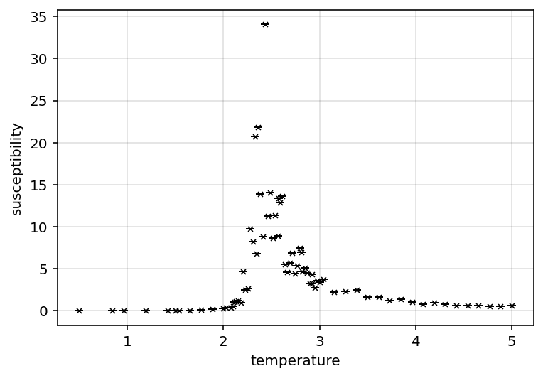
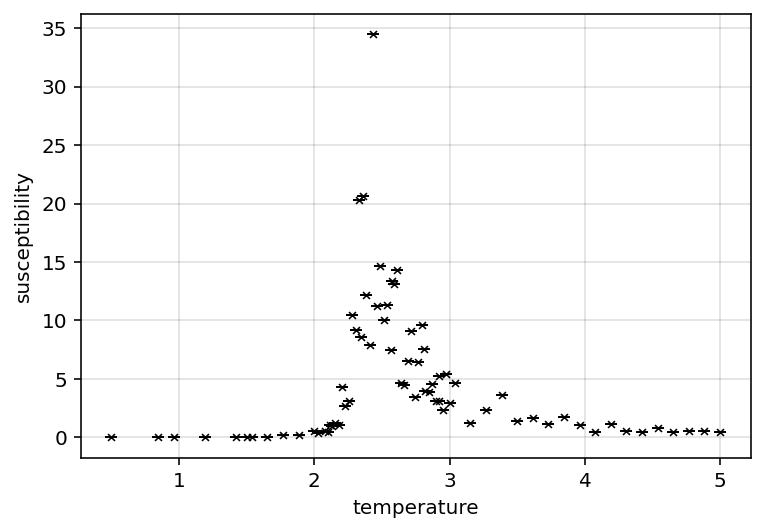
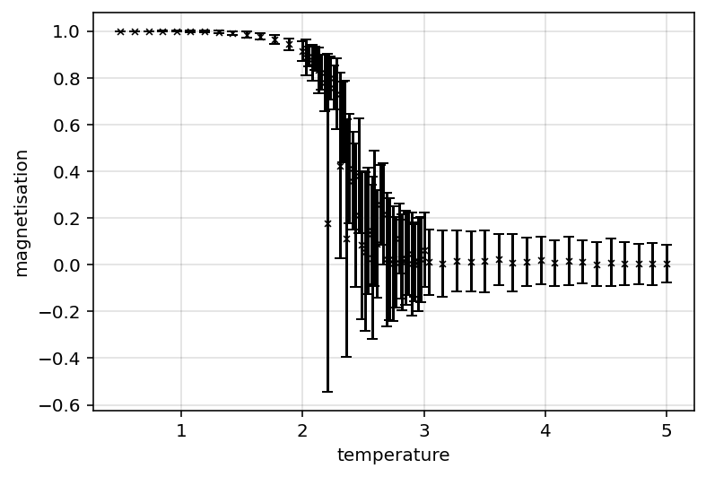
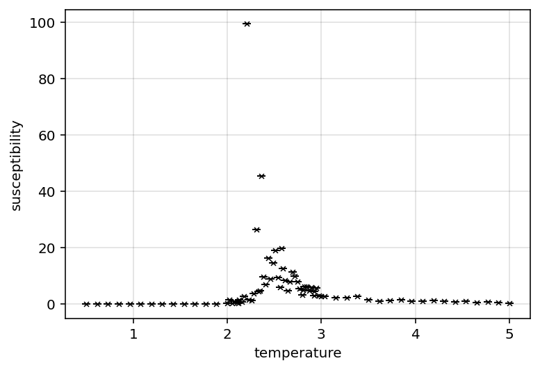
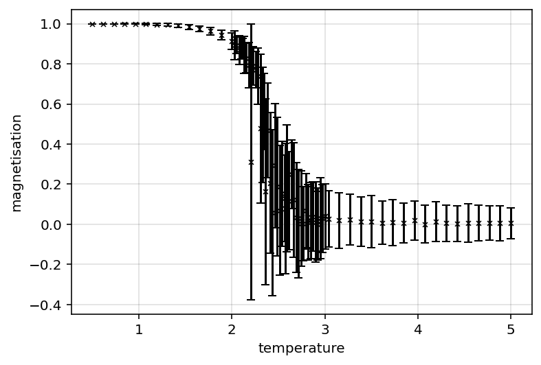
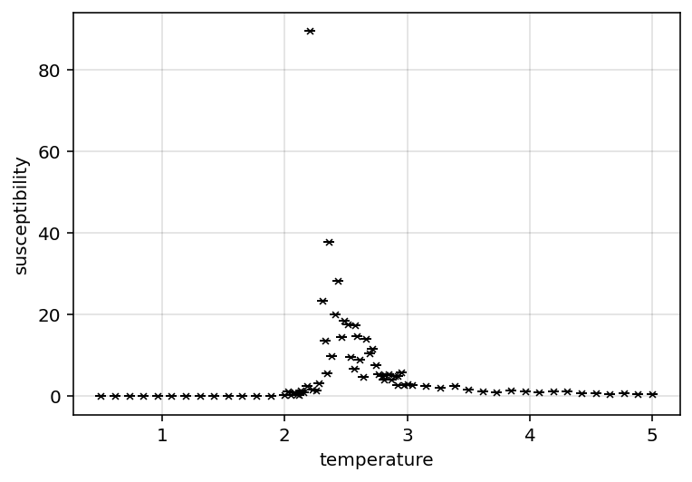
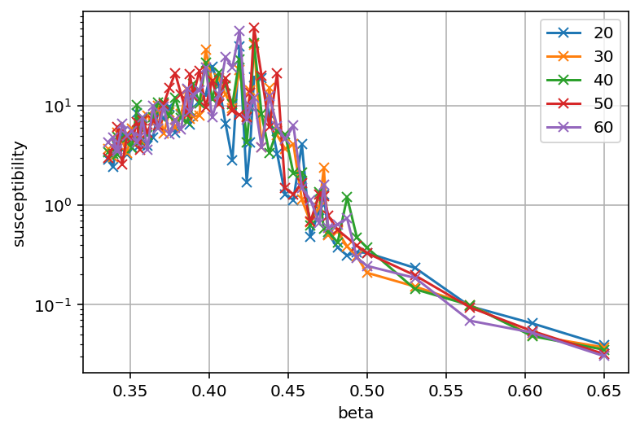
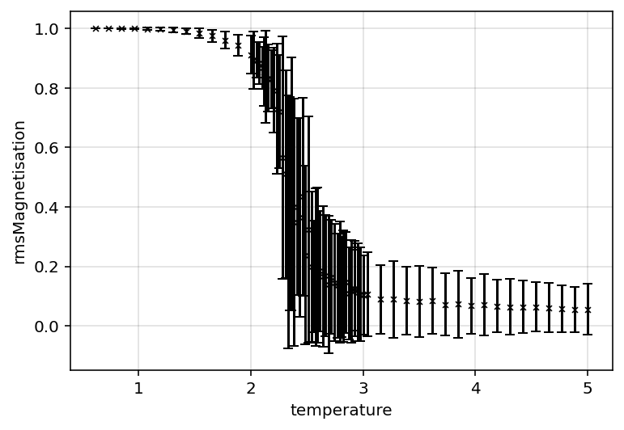
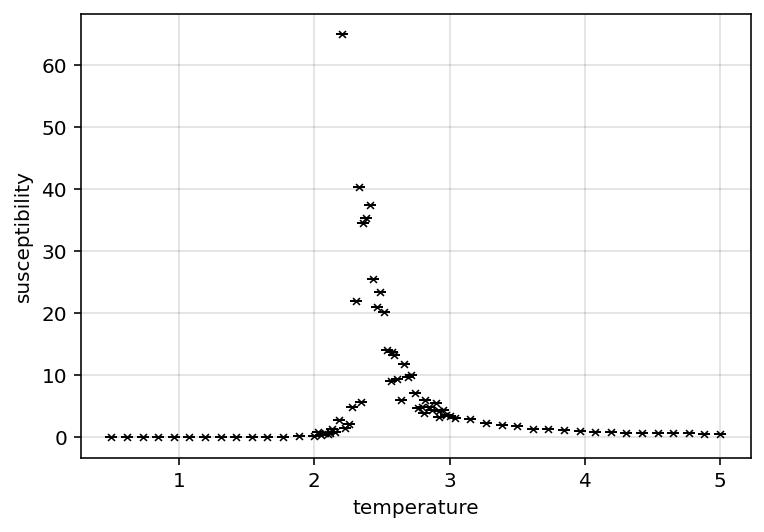
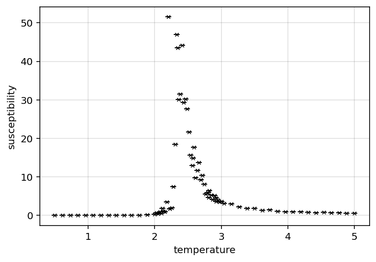

# Wk 5 Lab log
##Wk 5 summary
This week involved attempting the power law fit methods, and significant amounts of debugging and crossvalidation with the cumulant and direct fit methods.
Furthermore early attempts at more refined peak finding methods were implemented. 

## Lab log 19/02/2026

### Task list for today:

* standardise curtailement in exponent method (have it as optional DT parameter) [x]
* implement other critical exponent methods [x]
	* this includes slightly reworking graphing method to accomodate this [x]
	* maybe also setup return report system to make testing easier [x]
* evaluate critical exponents relative to each other (scaling laws)
	* ask Dr Turci if he knows why i may be getting these underestimates
		* need to more carefully examine finite size effects because model sizes are relatively small
* reevaluate cumulant critical temp method [x]
	* only evaluate neighbouring sizes; they should converge [x]
* potentially write up power law critical temp method; compare critical temps [x]

### general log:
tidied up exponent fitting method w/reportString and curtailement built in
Reworked cumulant temp method; the critical temp should converge to the critical temp for larger and larger models; so currently picking largest value, although performing a fit and extrapolating would be a better approach in future. This works quite well atm though.

note; curtailing the cumulant fit slightly (curtailing the lower end of the data) seems to improve the fit and improves the critical temperatures

Fiddling around with parameters; curtailing data helps magnetisation and heat capacity fit, but not susceptibility which is odd.

Going to implement power law critical temp method as this also produces estimate for critical exponents

a factor of 2 is showing up a lot comparing expected vs actual values... this is suspicious 

implementing power law method seems to imply $T_{c}=2.45$ which is wrong; matches closely to apparent critical temperature.

### power law method (based off of [@isingScaling]):
Power law method acknolwedges finite size effect with:

$(\beta(\infty) - \beta(V))^{-v}\propto L$ \ \ \ \ \ \ \ \ \ \ \ \ \ \ \ \ \  Eq 4.1 

Which yields:

$\beta(v) = \beta_{c}-c_{1}L^{\frac{-1}{v}}$ \ \ \ \ \ \ \ \ \ \ \ \ \ \ \ \ \  Eq 4.2

Which can be fit to the apparent critical temperatures derived from max susceptibility.

Susceptibility thus relates to size as:

$\chi_{max} \propto L^{\frac{\gamma}{v}}$ \ \ \ \ \ \ \ \ \ \ \ \ \ \ \ \ \  Eq 4.3

which can be fitted, and $\gamma$ extracted.

### log continued

Implementing the above, and excluding the 50x50 dataset (it seems to be off, will examine for outliers), $v= 0.91$ can be found (inc the 50x50 dataset yields $v=0.45$). These two cases yield $\gamma=0.44$ and $\gamma =0.22$. The fact that the 50x50 dataset seems off is frustrating...

Refactor code to be a bit cleaner; unsure if the above power law method works fully; given it's critical temp disagrees more significantly with standard values than the cumulant method, i'm hesitant to trust it.

### summary of issues at present
Currently unsure where to go from here...
There is some data issue with the 50x50 dataset, in order to evaluate finite size effects more data over a range of sizes is needed; however that is currently being generated. As such, i'm unsure how to examine my present data.

The current deviations from standard values generally are:

* $\beta \approx 0.07$ is less than standard value $\beta = 0.125$
* $\gamma \approx 0.45$ is significantly less than standard value $\gamma = 1.75$
* $\alpha \approx 0.27$ is significantly greater than stadard value of $\alpha = 0$

The critical temperature values from the cumulant ($T_{c}=2.229$) vs power law method ($T_{c}=2.451$) disagree significantly, with the cumulant method closer to the standard value of $T_{c}=2.269$. However the power law method is significantly limited by the small amount of data available to it, so this may improve in future.

Presently the power law method provides a reasonable estimate of $v=0.9$ (standard value of 1) if the 50x50 dataset is excluded.
However the power law method does not provide a good estimate of $\gamma=0.44$ if the 50x50 dataset is excluded. This is however somewhat consistent with the direct fit methods, which implies that whatever issue is causing these effects are present in both datasets.

That alongside the fact that the direct fit method seems to fit relatively well (given R^2 values are generally $R^{2}_{\beta}\approx 0.96$, $R^{2}_{\gamma}\approx 0.69$, $R^{2}_{\alpha}\approx 0.50$) suggests that this isn't an issue with the analysis, but an issue with the data.

Some possibilities may explain this:

* incorrect dynamics - some aspect of the simulation is incorrectly implemented
* incorrect observable computation - the observables (I.E, susceptibility) aren't correctly computed
* some additional finite size effect hasn't been accounted for

Talked to Dr Turci for advice:

* potential optimisation; hardcode 2d, 3d mc sweep
* power fit as log instead of as is
* correlated data may be main issue; run data for longer esp near criticality (may be worth computing autocorrelation)
	* sample "sparse" for susceptibility 

### Plan of action given this insight:
* switch exponent fit to log fit - this may address some of my exponent issues
* try sampling susceptibility on sparser data; see if that improves "noisiness" in data
	* potentially compute autocorrelation length on data to quantify results
* extend data over longer MC sweeps
	* this may require purpose built optimisation

### general log continued:
attempted exponent fit w/log fit; improves results slightly for magnetisation

Quickly attempted to sample every 20th data point for susceptibility to try and reduce correlations; this yields:

{fig-align="left"}

{fig-align="left"}

Makes data noisier, worsening issue.

Have implemented "add data" method to dataset. Will hopefully allow me to append data and improve results.

Testing on the 20x20 dataset, adding 200 simulation steps results follow:

{fig-align="left"}

{fig-align="left"}

{fig-align="left"}

{fig-align="left"}

Qualitatively this seems to improve the noise particularly in the susceptibility. Furthermore the magnetisation exponent $\beta$ has seemingly improved slightly from $\beta=0.066$ to $\beta=0.079$.
I suspect that this will be the main source of error for most of the exponent data; more data required.

Have also implemented purpose built 2D, 3D and 4D mcMove method to main config; should be faster for those cases; seems faster thus far for 2D case.

### Plan from this point:

* extend main datasets over longer sweeps; see what the effect of this is 
* may need to adjust cumulant computation - it doesn't look like a logistic function anymore
* if this fixes the current issues (particularly noisy susceptibility); then can take main results 
* else may need to look at autocorrelation times

## lab log 20/02/2026
Initial examination of the extended datasets seems to indicate significant improvement in noise, however the direct fit methods for critical exponents continue to fail.
As such, the task list may follow:

* examine refined data
	* compute cumulant, power law critical temperature on current dataset, compare to actual values
	* compute fit based critical exponents for all datasets; record results
	* compute power law $\gamma$ critical exponent to see if data refinement has improved results
* If power law critical temperature converges to standard value, it's use may be accepted
	* if so, its value for critical exponents may be more reliable
	* if its $\gamma$ estimate is closer to standard values, it may be worth implementing power law measures for other critical exponents
* if power law critical exponents are better, can accept result and consider main analytical work complete; following steps include:
	* generate "comparison results":
		* generate 3D datasets to reproduce analysis
		* go through mean field theory results for comparision
		* potentially generate 1D results for comparision
	* report planning and writing:
		* decide on "core narrative" of report; have some ideas (frame report as simple execution of critical exponent methods; compare results across dimensions/mean field theory and to standard results), but need more detail
		* decide on plots and data needed for report; code methods for presentation
		* write up report
		* clean up lab book for submission

## Lab log 21/02/2026
An issue being encountered is there is still SIGNIFICANT noise in the susceptibility values:

{fig-align="left"}

This is a problem as it means the maximum susceptibility hasn't been found reliably, making the power law method unreliable.
In order to verify this idea (that the issue is the data and not the method); synthetic data was inputted to test the method.
This seems to produce reasonable results, thus it is likely the issue is purely one of data.

From this point there are a few potential things worth considering:

* compute autocorrelations; this may yield some insight into the noise
* Brute force compute more data - this should reduce the noise further (note, saving the configs for sim steps is probably unecessary and expensive atp; can remove to speed up computation)
* perhaps for max susceptibility; take average of 3 largest values instead of largest value; may help with criticality sensitive noise
* perform the power law method for critical exponent for $\beta$ - the susceptibility data is particularly noisy whilst the magnetisation data is not. Therefore attempting the method with $\beta$ may produce better results which may validate the method further, and provide insight on how best to approach the issue.

Of these options, this last option seems reasonable to try first.
Implemented the method, it seems noise is still a major factor; HOWEVER, at the cumulant derived critical temperature ($T_{c}= 2.19$), it computes a value of $\beta=0.011 \pm 0.02$; which whilst subject to A LOT of noise, is within uncertainty. This uncertainty is very large given the noise, however this suggests the power law methods will benefit from further refinement of the data.

{fig-align="left"}

Have set the main datasets to generate 500 more datapoints. Hopefully this will (albeit slowly) converge the data.

If that significantly improves the issues, this lab will likely be able to accept the power law derived exponents and critical temperatures.

{fig-align="left"}
{fig-align="left"}

Off of early results, this does seem to qualitatively smooth out the results and reduce the maximum susceptibility.
Also note how there appears to be an apparent peak at $\chi\approx30$ - this may suggest that the actual peak $\chi\approx51$ is an anomaly due to noise. Unsure how to systematically acertain this however.

With more data and taking a mean around the critical point instead of directly at the critical point; (and setting $T_{c}=2.269$) am starting to get reasonable values for some of the critical exponents by power law method ($\beta= 0.13 \pm 0.06$, and $\gamma=1.7 \pm 1.2$). There is evidently still significant noise, however it is clear that this brute force approach will yield correct results.

## Lab log 22/02/2026

Manually filtered out apparent outliers from susceptibility to see if that improves results to get an idea of how badly noise is affecting data
Heat capacity peaks are a lot clearer and less noisy than susceptibility.

General experimentation; $\beta$ power law fit seemingly working alright; $\gamma$ is temperamental

### to do list:

* fix exponents
	* other susceptibility peak finding methods?
* fix cumulant (need to curve fit)
* generate nice plots
* start drafting report (note acknowledging noise due to limited compute may be interesting narrative twist to salvage this)
* generate 3D data

have revised cumulant method (have it power law fit the intersection temperatures); is producing $T_{c} = 2.22 \pm 0.08$ which agrees with standard values. 

The exponent values are largely reasonable when using $T_{c}=2.269$ however are without uncertainty otherwise...
May need to work a bit more on the critical temp methods...

## Lab log 23/02/2026
have implemented a more general "find maximum" method in dataset; is meant to be a wrapper for different peak finding methods.
Currently has a direct (largest value in observable array) and an "interpolate" method. The interpolate method finds the direct maximum, then draws 2 straight lines from the 4 closest points (left hand and right hand side of point); then finds their intersection. THe idea of this is to try and incorporate more information into the maximum estimate. Particularly for susceptibility, this method is expected to reduce noise due to being near criticality and incorporate information from more points. Also included a center of mass method which computes $T_{max} = \frac{1}{\sum O} \sum O\cdot T$ for observable O; should produce the peak if the data is symetric about the critical temperature.