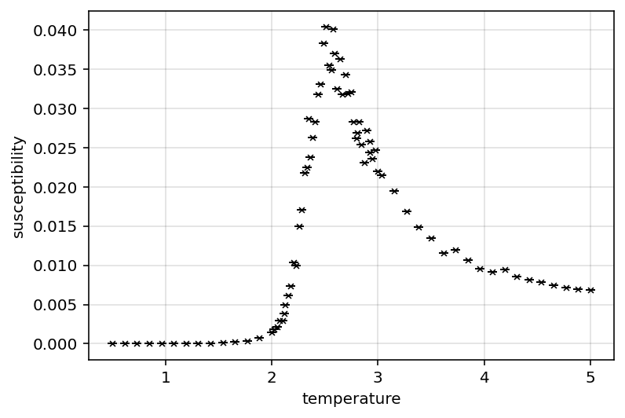
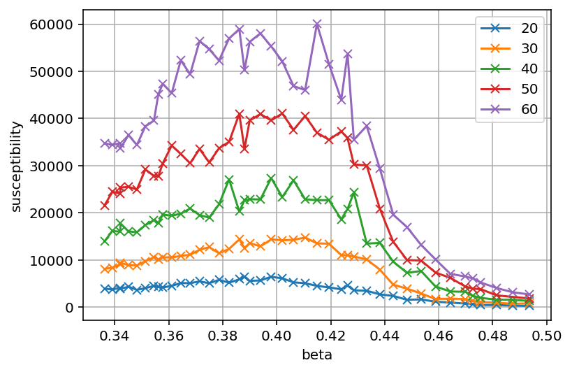
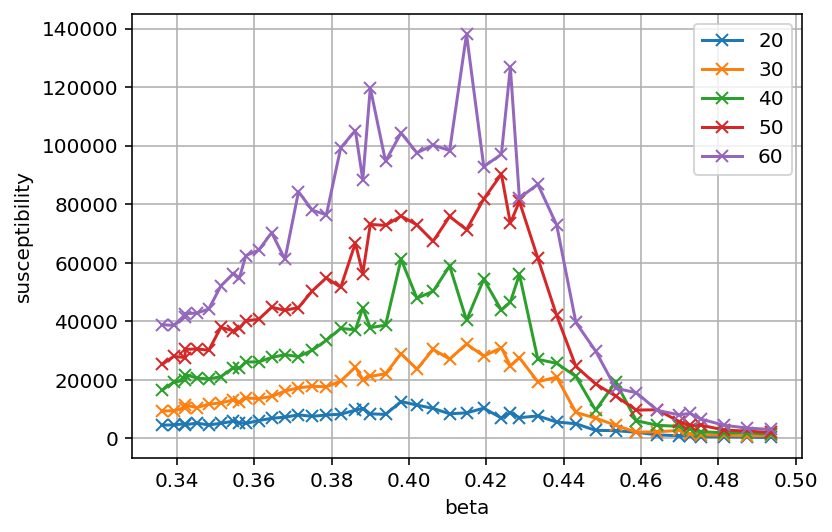
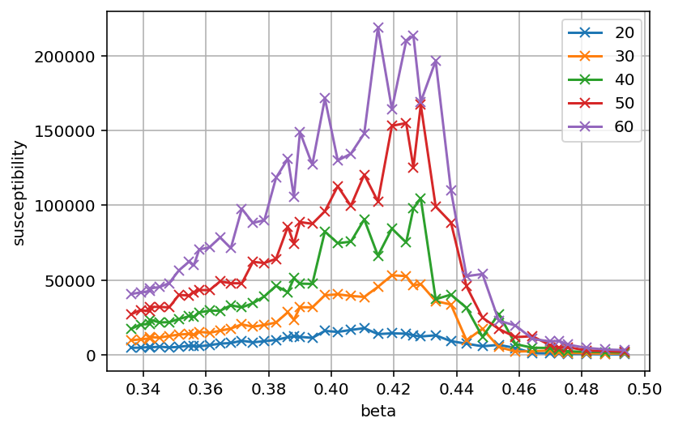
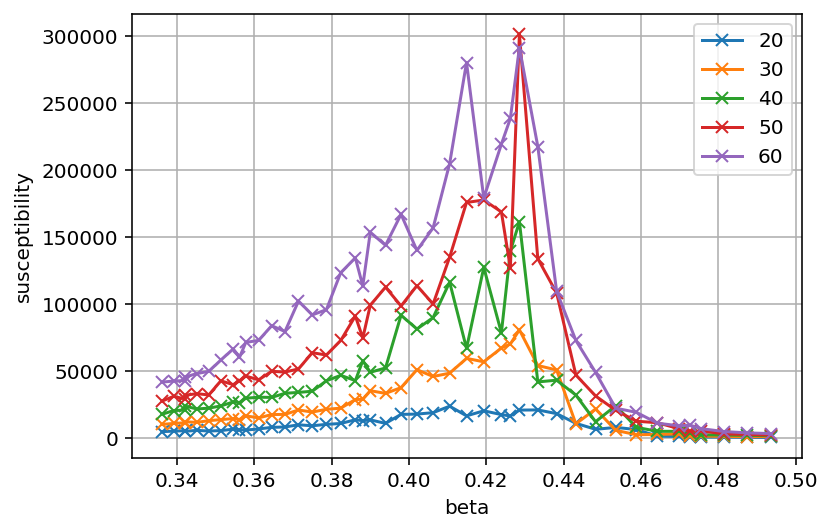
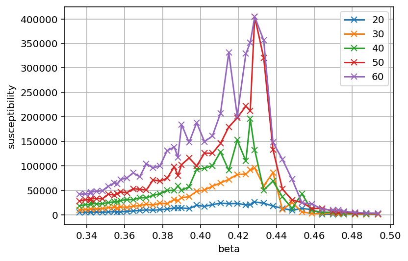
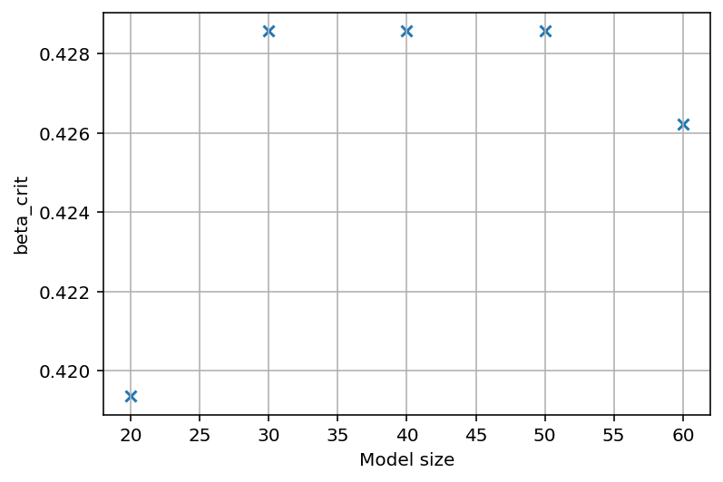
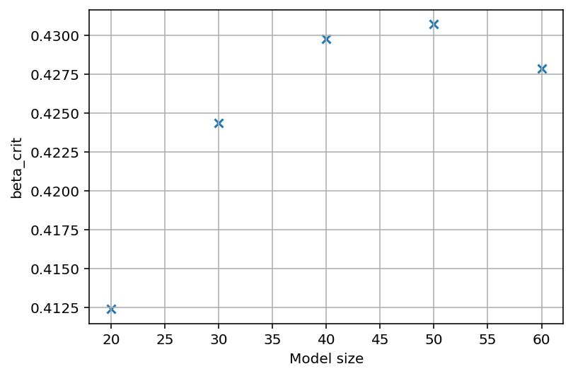

# Wk 6 Lab log
## Wk 6 summary
This week finally fixed the issues with susceptibility. Therefore was able to refine analysis to a more final state. 

## general to do list
At present time most of the methods generally work, but need significant amount of equilibration time to work. 3D data is currently being generated, and am fiddling a bit with the 2D data to produce the cleanest results.

Main to do list at present:

* data related stuff
	* wait on 3D data to generate
	* fiddle with 2D data
		* try log fits again; i doubt it'd help, but may do
		* try the different "maxSusceptibility" methods
		* try susceptibility over sparser data
	* implement heat capacity power law fit (i doubt this will work nicely, but it's implementation should be simple)
* writing related stuff
	* make nicer plots for data
	* get citations in a .bib file
	* write up discussion for report
	* proofread report
		* methods section may be good place to explain all the processing steps (I.E, the peak finding...)
		* may need to justify use of metropolis algorithm
	* cleanup lab book

## Lab log 26/02/2026:

* attempted sparser data for susceptibility; makes exponent worse
* am attempting sampling "later data" allowing more equilibration - makes the data worse (unsuprising as it reduces the statistics)
* noise in susceptibilities is still causing issues
* am modifying add sim steps method to be narrower around peak; going to try and generate even more data
* am also trying curtailing of raw magnetisation values
* implemented heat capacity method; seems to work about as well as the other exponent methods; the values are wrong but within (large) uncertainty
* all the fitting methods seem to work quite well, however the susceptibility data is still very noisy, and the beta exponents are incorrect despite the fit fitting well
* on a whim attempted the "later data sampling" it may actually be helping qualitiatively examining the susceptibility plots; performing a more extreme later sampling - still has odd outliers but may be better
	* it seems to indicate low temperature side of data tends to be noisier
	* also seems to be a sweet spot between using later data and not having enough points for a useful mean
	* am also combining this with sparser data
	* this seems to be  working; however the later data i use, the less data i have to work with 

Talked to Dr Turci, he suggests:

* plot susceptibility over time series
* variances of magnetisation and energy look comparable in terms of behaviour
* maybe try subdividing susceptibility data and taking the mean? may help? 
	* THIS MAY BE FIXING THINGS - its making a much smoother

{fig-align="left"}

There's still some work to fine tune this; the size of the "block" size (the #steps per variance block), I.E:

{fig-align="left"}

{fig-align="left"}

{fig-align="left"}

{fig-align="left"}

{fig-align="left"}

Seemingly issues arise for blocks larger than 750.

Additional note; dividing the variance of magnetisations by the number of spins seems to jumble the data up significantly.

Implemented another maxObservable method; finds direct peak; then performs Center of mass calculation about that point; locally about peak can assume symetric function; so including more information from surrounding points may help refine peak finding. Seems to refine maxima points from:

{fig-align="left"}

to

{fig-align="left"}

May however need to double check power law fit cause something seems off.
Power law method for $T_{c}$ seems off; need to reexamine. Have checked it; found issue, initial guess for exponent was positive when it should be negative.

Thinking of report citations needed:

* General statement of ising model, model hamiltonian and observables (complexity and criticality textbook)
* statement of critical power laws (scaling and renormalisation in statistical physics textbook)
* statement of scaling law method (https://iopscience.iop.org/article/10.1088/0305-4470/26/20/014/pdf goes through method)
* cumulant method
* metropolis algorithm
* quote standard values for critical temp and relevant exponents
* mean field theory derivation 
* mean field theory results

### To do list:

* final analytical/code tasks
	* settle on standard analytical method (blocksize, data, critical temp method, assumptions...) to generate "standard results"
		* don't forget to incude R^2 values for fits
	* use standard analytical method on 3D data to generate 3D results
		* may need to extend 3D datasets further about critical temps
	* rework plotting methods to make prettier plots of standard results
		* standardise size to column width
		* standardise font size
		* standardise error bars and plot markers
		* consider log plots for some of the fits
		* consider sub gridlines
		* figure out units
	potentially export data as CSV; currently pickled objects, however observable data is in datafame; saving data as dataframes for archiving may be better (for after lab being done; i don't want to delete the data entirely, but would like to reduce it's storage requirements)
* report writing:
	* add results and plots to report	
	* add more substance to report (discussion, conclusion, abstract, methods)
		* also draw illustrations as necessary (do after however)
	* get and implement necessary citations into report
	* proofread report as necessary
	* narrative idea; treat 2D data as "pathfinding" for 3D exploration - mostly explored 2D data to setup "analytical machinery" which will be applied to 3D; this narrative follows the research process and may help account for extreme finite size effects in 3D data
* lab book:
	* Reorganise as necessary
		* tidy up header/section formatting
		* potentially tidy up log, theory... organisation; its currently a bit messy (potentially into their own pages)
	* content tidying:
		* tidy up log formatting and clarify context as needed
		* check over equations; make sure they're all correct
		* add/clarify relevant figure captions
		* tabulate test cases... may be clearer
	* summaries
		* fill out weekly summaries; should be a brief sumamry and conclusion of what was acheived/learned that week
	* render as pdf
	