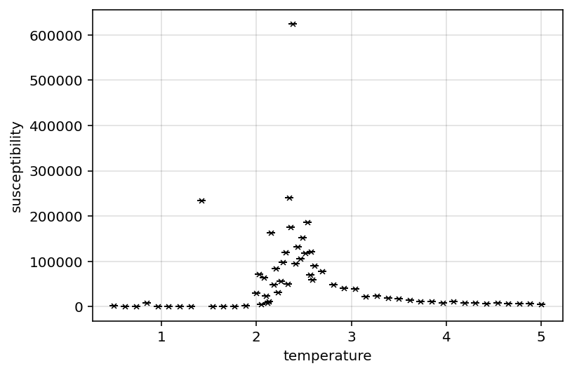
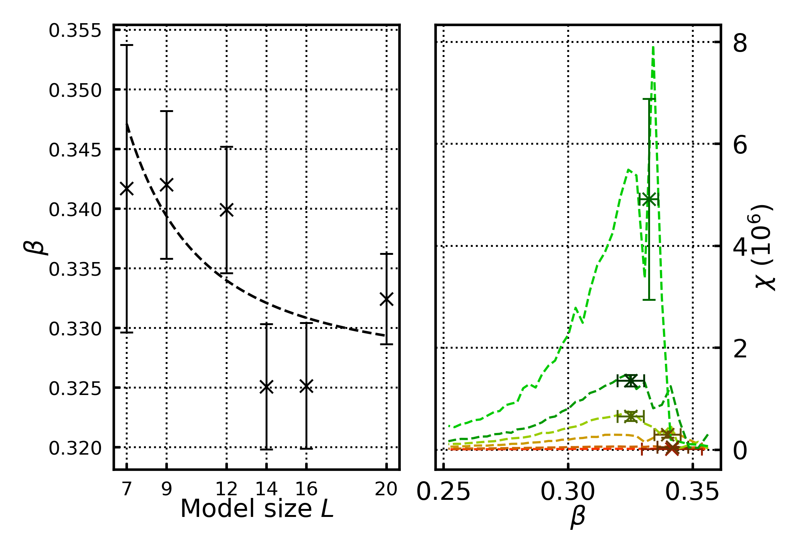
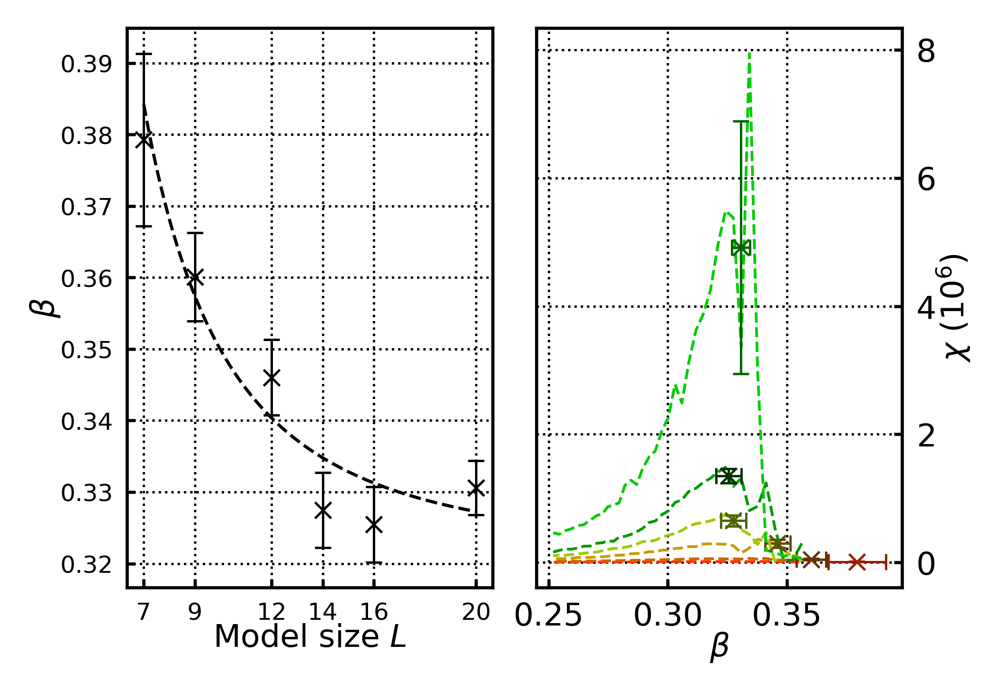
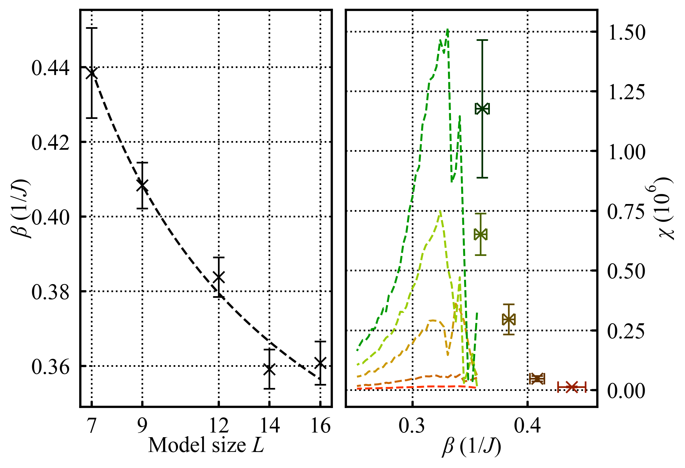

# Post Wk6 work

## To do list:

* final analytical/code tasks
	* settle on standard analytical method (blocksize, data, critical temp method, assumptions...) to generate "standard results"
		* don't forget to incude R^2 values for fits
	* use standard analytical method on 3D data to generate 3D results
		* may need to extend 3D datasets further about critical temps
	* rework plotting methods to make prettier plots of standard results
		* standardise size to column width [x]
		* standardise font size [x]
		* standardise error bars and plot markers [x]
		* consider log plots for some of the fits
		* consider sub gridlines
		* figure out units
	* potentially export data as CSV; currently pickled objects, however observable data is in datafame; saving data as dataframes for archiving may be better (for after lab being done; i don't want to delete the data entirely, but would like to reduce it's storage requirements) - alternatively strip raw configs from data; that seems to be main source of bloat
* report writing:
	* add results and plots to report	
	* add more substance to report (discussion, conclusion, abstract, methods)
		* also draw illustrations as necessary (do after however)
	* get and implement necessary citations into report
	* proofread report as necessary
	* narrative idea; treat 2D data as "pathfinding" for 3D exploration - mostly explored 2D data to setup "analytical machinery" which will be applied to 3D; this narrative follows the research process and may help account for extreme finite size effects in 3D data
* lab book:
	* Reorganise as necessary
		* tidy up header/section formatting
		* potentially tidy up log, theory... organisation; its currently a bit messy (potentially into their own pages)
	* content tidying:
		* tidy up log formatting and clarify context as needed
		* check over equations; make sure they're all correct
		* add/clarify relevant figure captions
		* tabulate test cases... may be clearer
	* summaries
		* fill out weekly summaries; should be a brief sumamry and conclusion of what was acheived/learned that week
	* render as pdf
	

## Lab log 01/03/2026
Have also decided to recover scraps of 100x100 data. Its not a full dataset, but should have sufficent detail to provide another datapoint to the 2D data. Currently refining the data by running more MC steps about the critical point.

Am still waiting on 3D data to generate.

## Lab log 02/03/2026
Have implemented a "wipeData" method - currently the config objects have a lot of saved states - this takes up a lot of storage space. Implemented this method to wipe all but that last state from the memory to save storage space and speed up load times.

This has reduced stored data significantly and speeds up load times. Not necessary, but convenient.

Examining scrapped/refined 100x100 data there is still significant noise:

{fig-align="left"}

Including it in the primary results significantly skews the final results.
Will refine the dataset further in the background, but if it can't be handled will omit it.

May need to combine the susceptibility and power law fit into one graph.
Setting the 2D and 3D plots side by side may make the plots too small to see, so trying to compress more information into a single plot may be advisable. 

## Lab log 03/03/2026
More plot tweaking.
Combined all susceptibilities and power law critical temp fit into one plot (subplotted). This works quite well, so instead of subplotting 2D, and 3D data it may be better to subplot combine the existing plots together.

For instance, the three fits for $\beta, \gamma, \alpha$ could be combined into one subplot which share an x axis? This may help compact plot information. Potentially only combine the $\beta, \gamma$ ones - heat capacity to be shown seperatedly; the fit for heat capacity is poor so doesn't reveal a lot of information. Worth showing an exemplar to justify not showing it again.

## Lab log 05/03/2026
Fiddling with analytical specifics (mostly the time block and RMS mag mean radius). Refining the time block improves the $T_{c}$ estimate; which has a knock on effect on the $\beta$ estimate. have also streamlined the data generation-> latex report doc pipeline; it now autofills the final results into the report. it writes the results as latex commands of form /newcommand{/value}{/value /pm dev} to a seperate .tex doc which is imported by the report file. That way results can be quoted as /value, and it will autoupdate every time the main analytical code is run.

## Lab log 06/03/2026
note to self; beta parameter is very sensitive to critical temperature were its evaluated; so small deviations in T_c have large effects in beta.

Writing note to self: need to do a proofreading sweep checking notational consistency; particularly the difference between $\beta$ and $\beta_{m}$

## Lab log 07/03/2026
Note to self; adjusting the apparent critical temperature by the ratio of $\frac{n_{spins}}{n_{connections}}$ where $n_{connections}$ are all the connections between cells as:

$n_{connections d=2}=(l-2)^{2}\cdot4+(l-2)\cdot4\cdot3+4\cdot2$ Eq. 7.1

$n_{connections d=3}=(l-2)^{3}\cdot6+6\cdot(l-2)^{2}\cdot5+8(l-2)\cdot2+8\cdot3$  Eq. 7.2

So scaling the apparent critical temperatures as 

$T_{adj} = T_{app} \cdot \frac{n_{connections}}{n_{spins}}\cdot z$  Eq. 7.3

(z is number of neighbours per cell) yields smoother/better fitting power law critical temperatures fits and slightly improves their values.

The ratio $\frac{n_{spins}}{n_{connections}}$ for an infinite sized ising model approaches $\frac{1}{z}$. Given that the mean field theory critical temperature is $T_{c}=\frac{jz}{k_{b}}$, it could be argued that performing the adjustment in Eq.7.3 corrects for finite size effects, however the power law fit supposedly already does that.

I'm unsure wether or not this should be included in the report, or how.
Eq. 7.1 and 7.2 were quickly derived from first principles (analysing the number if spins that are "within" the primary volume with full adjacencies, how many spins are on various edges of the cubic area/volume), so i'm unsure how/where to cite them. Furthermore given that this isn't part of a standard method i'm hesitant to use them in the "primary analysis/results".

I think i can justify it somewhat within an exploration of the extreme finite size effects in 3D; this improves the $T_{c}$ results slightly, so this sort of analysis could be used to attribute the issues with the 3D data to extreme finite size effects...

{fig-align="left"}

{fig-align="left"}

Have included these points in report in order to substantiate finite size effects (and have been able to produce better results than above)

{fig-align="left"}

This seems to indicate that finite size effects significantly account for the underestimated 3D critical temperature. However the validity of this correction is unclear. Furthermore even if it is valid, how to apply it to the raw observables to correct the critical exponents is also unclear.

As such its currently mostly a suggestive piece of evidence towards the inaccuracies in the 3D results being due to extreme finite size effects.

## Lab log 08/03/2026
Note to self; may be worth showing example model configurations below, above and at critical temperature in the report. May help visualise/conceptualise what the phase transitions physically means/looks like.

## Lab log 09/03/2026
Have a "submission ready" report .draft done

## Lab log 10/03/2026
Have asked some friends to proofread my complete draft; have spent some time cleaning up lab book. 
Task list from here on out:

* final proofreads of report
* proofread lab book
* Transfer the full lab book bibliography from the spreadsheet to the quarto notebook.
* republish quarto notebook in "final" state
* render as complete pdf for submission